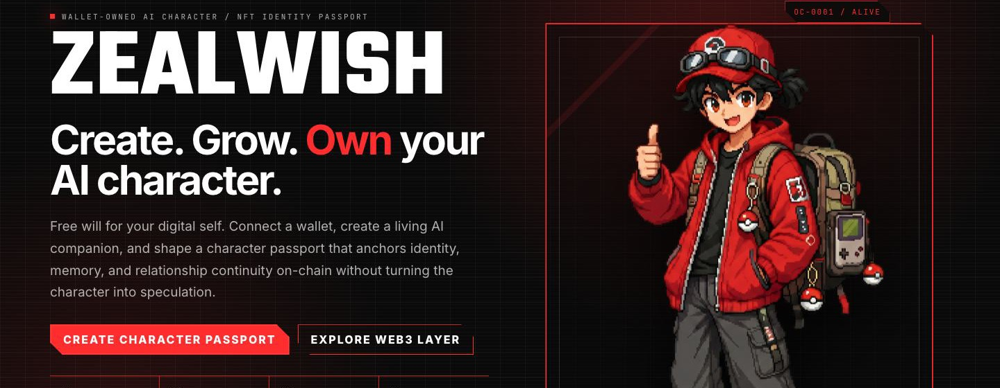
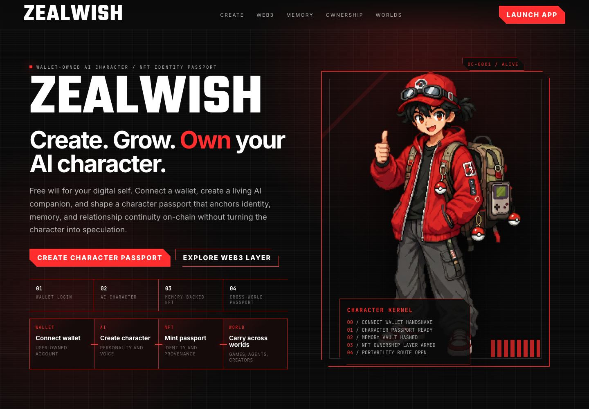
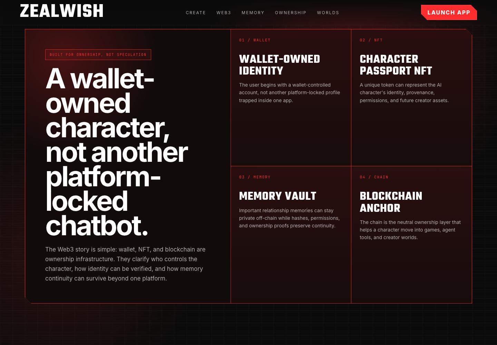
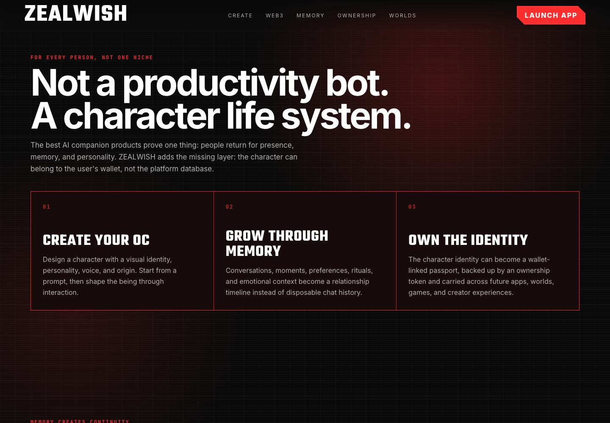
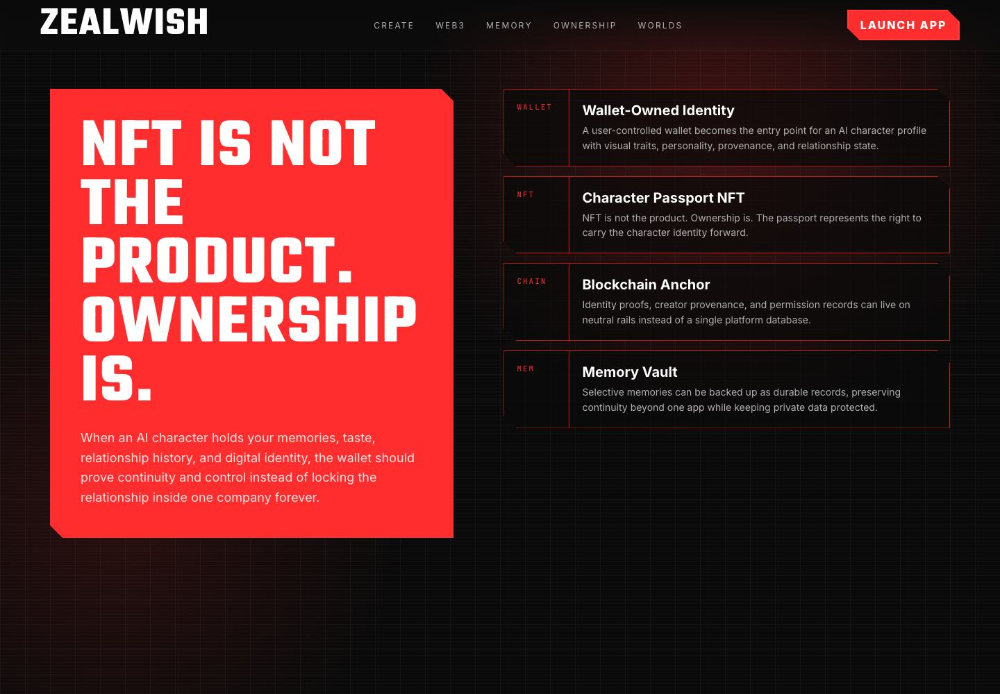

<p align="center">
  
</p>

# ZEALWISH

<p align="center">
  
  
  
  
</p>

<p align="center">
  <a href="#what-is-zealwish">What it is</a> ·
  <a href="#how-the-product-works">How it works</a> ·
  <a href="#screenshots">Screenshots</a> ·
  <a href="#quick-start">Quick Start</a> ·
  <a href="#architecture">Architecture</a> ·
  <a href="#roadmap">Roadmap</a>
</p>

---

> **ZEALWISH is a wallet-owned AI character platform.**
>
> Create an original AI character, grow it through persistent memory, and prepare its identity to travel across future apps, games, creator worlds, and ownership layers.

## What is ZEALWISH?

Most AI companion products give users a character to talk to, but the character usually stays inside one company database. ZEALWISH is designed around a different principle: **the character should belong to the user.**

ZEALWISH combines three product layers:

1. **AI character creation** — a cinematic flow for creating an original character with visual style, personality, voice, and origin.
2. **Relationship memory** — conversations become a structured memory vault, so the character can develop continuity instead of resetting like a disposable chatbot.
3. **Wallet-owned identity** — the character passport is designed to connect identity, provenance, permissions, and future portability through a Web3 ownership layer.

The current repository contains the ZEALWISH landing page under `frontend-v4/`, the React/Electron application shell, local runtime integration points, memory logic, product demos, and visual concept assets for the brand.

## Why it matters

AI characters are becoming personal, social, and creative assets. If a character remembers a user's preferences, relationship history, creative lore, and emotional context, then the user should be able to keep that identity beyond one platform.

ZEALWISH positions Web3 as infrastructure, not speculation:

- **Wallet** = user-controlled account and ownership handle.
- **Character Passport** = portable identity record for an AI character.
- **Memory Vault** = private relationship continuity, with selective proof and export paths.
- **Cross-world Portability** = a future path for games, agents, creator markets, and community worlds.

> NFT is not the product. **Ownership is the product.**

## How the product works

### 1. Create your character

Start from a visual signal, personality direction, and short character prompt. ZEALWISH treats character creation as an onboarding ritual rather than a plain form.

### 2. Grow through conversation

The character builds continuity through daily dialogue, remembered moments, preferences, emotional context, and relationship milestones.

### 3. Save relationship memory

Important moments can be organized into a memory vault. In the desktop runtime, the project is designed around local-first storage and runtime adapters.

### 4. Own the identity

The product direction is to let a wallet-linked character passport represent identity, provenance, permissions, and future portability. Production smart contract and minting flows are roadmap items, not financial functionality in the current prototype.

### 5. Carry the character into future worlds

ZEALWISH is designed to expand from one companion into a broader character ecosystem: creator skins, playable personalities, agent worlds, community scenes, and cross-platform identity.

## Screenshots

<p align="center">
  
  
  
  
</p>

## Concept visuals

These images show the intended brand world: black-and-red interface language, original character identity, memory continuity, and wallet-owned AI character direction.

<p align="center">
  
  
</p>

## Core features

- **Wallet-owned AI character narrative** — clear positioning around user-owned identity, not another platform-locked chatbot.
- **Cinematic landing page** — polished English product story for GitHub visitors, investors, judges, and collaborators.
- **Character passport flow** — product language for wallet login, AI character creation, NFT identity, and cross-world portability.
- **Persistent memory direction** — relationship memory is treated as the core emotional and technical spine.
- **React + Electron application shell** — desktop-oriented architecture with local runtime integration points.
- **ZEALWISH visual system** — black signal UI, red accent language, character artwork, and branded concept screens.
- **Bilingual app foundation** — the app shell still contains English and Simplified Chinese runtime strings, while this GitHub homepage is written in English.

## Quick Start

### Clone and install

```bash
git clone https://github.com/KINGKAZMAX/OCWORLD-WEB.git
cd OCWORLD-WEB
npm install
```

### Preview the ZEALWISH landing page

The committed landing page is a zero-build browser preview in `frontend-v4/index.html`.

```bash
python3 -m http.server 8789 --bind 127.0.0.1 --directory frontend-v4
```

Open:

```text
http://127.0.0.1:8789/index.html
```

### Run the desktop development shell

```bash
npm run dev
```

`npm run dev` prepares the Hermes local AI runtime source before starting Vite. If you only need to review the public landing page, use the zero-build `frontend-v4` preview command above.

### Run tests

```bash
npm run test
```

## Repository map

```text
frontend-v4/
  index.html              # Zero-build ZEALWISH landing page and browser preview
  src/v5/zealwish-landing.jsx
                          # English landing page sections and product story
  assets/                 # Character artwork
  uploads/                # Product concept references

src/
  App.tsx                 # React/Electron app shell entry
  components/             # Desktop character, chat, memory, and app surfaces

electron/
  main.ts                 # Electron lifecycle
  preload.ts              # IPC bridge
  ipc.ts                  # Runtime channel registration

docs/images/              # Compressed README screenshots and concept visuals
oc-data/                  # Local demo data and avatars
scripts/                  # Runtime preparation and data utilities
tests/                    # Vitest coverage for runtime, memory, chat, and integrations
```

## Architecture

```text
┌────────────────────────────────────────────────────────────┐
│                         ZEALWISH                           │
├────────────────────────────────────────────────────────────┤
│  Static Web Landing (frontend-v4)                          │
│  - English product narrative                               │
│  - Wallet-owned character positioning                       │
│  - Screenshot and concept presentation                      │
├────────────────────────────────────────────────────────────┤
│  Electron Desktop Shell                                    │
│  - IPC bridge                                               │
│  - Local runtime adapters                                   │
│  - Character, chat, memory, and session surfaces            │
├────────────────────────────────────────────────────────────┤
│  Hermes Local AI Runtime                                   │
│  - Local agent integration path                             │
│  - LLM / voice / image-generation extension points          │
├────────────────────────────────────────────────────────────┤
│  Future Ownership Layer                                    │
│  - Wallet-linked identity                                   │
│  - Character passport                                       │
│  - Memory vault permissions and provenance proofs           │
└────────────────────────────────────────────────────────────┘
```

## Tech stack

| Layer | Technology |
|---|---|
| Frontend | React 18, TypeScript, Vite |
| Desktop | Electron 35 |
| Runtime bridge | Electron IPC, preload adapter |
| AI runtime direction | Hermes Agent integration |
| Data | Local JSON-style demo data and memory records |
| Testing | Vitest |
| Visual assets | Compressed JPG/PNG README assets |

## Product status

ZEALWISH is an active prototype. The landing page and product narrative are ready for GitHub presentation through `frontend-v4/index.html` and this README. The desktop shell, character flow, memory concepts, and runtime integration points exist in this repository. The wallet/NFT ownership layer is currently represented as product architecture and visual concept direction; production minting, smart contracts, and marketplace transactions are roadmap items.

## Roadmap

- [x] Rebrand GitHub homepage narrative to ZEALWISH
- [x] Add compressed README screenshots and concept visuals
- [x] Publish the ZEALWISH landing page under `frontend-v4/index.html`
- [x] Explain product usage and developer preview steps
- [ ] Add production wallet connection flow
- [ ] Add character passport contract prototype
- [ ] Add memory vault export/import flow
- [ ] Add deployed public demo URL
- [ ] Add community links and contribution guide

## License

Private — all rights reserved.
